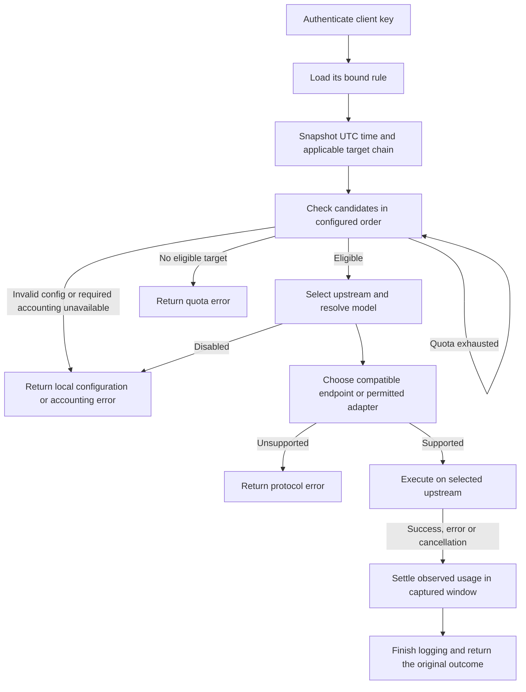

# 28 — Key-Bound Routing, Schedules and Upstream Quotas

Status: **Implemented and integration-verified on 2026-09-22**.

Design revision: **R3**. Decisions confirmed with the owner on **2026-09-22**.

Scope: Dashboard navigation and configuration, Proxy routing, model catalogs,
local SQLite persistence, migration and isolated verification.

This document replaces the model-pattern routing design in
[11](11-custom-upstream-routing.md). It preserves the layering
contract in [20](20-architecture-refactor.md) and the operational constraints in
[26](26-agent-operations.md). Sections 1–12 record the reviewed product contract;
section 13 preserves the original design sign-off, and section 14 records the
implementation and its verification.

## 1. Confirmed product contract

| Area | Required behavior |
| --- | --- |
| Navigation | Add a **Routing** sidebar group containing **Upstreams** and **Routing Rules**. Keep Connect as the key-management and client-configuration page. |
| Keys | Every client key belongs to exactly one rule. A rule can serve many keys. There is no unbound-key routing path. |
| Existing keys | Bind every existing database key to the built-in GitHub Copilot rule without rotating secrets or changing key IDs. That rule enables protocol conversion and initially selects `gpt-5.6-sol` for `auto`. |
| Custom upstreams | Configure one format per upstream: Anthropic Messages, OpenAI Chat Completions or OpenAI Responses. Remove model patterns and model-name conflict checks. |
| Copilot | Show one protected, non-deletable built-in upstream using the existing GitHub OAuth/Copilot JWT integration. It has no implicit fallback privilege. |
| Rules | Support an all-day policy, a repeating daily timetable, or a weekday-specific timetable. The local editing grid has half-hour steps; UTC offsets need not be multiples of 30 minutes. Support overnight periods and copying one day's settings to other days. |
| Time | Persist and evaluate schedules in UTC. Convert browser-local editing/display values in the frontend, including day-of-week rollover. |
| Candidates | Each period has an ordered list of quota candidates followed by one terminal fallback target. Every target names an upstream and an explicit model ID, selected from its catalog or typed manually. |
| Schedule gaps | Time outside configured periods uses the rule's visible default chain. Every chain has zero or more quota candidates and one required terminal target; an empty chain is invalid. |
| `auto` | Resolve the rule and period from the authenticated key, select an upstream by candidate order and quota, then use that candidate's configured model. |
| Explicit models | Select the same upstream by rule, time and quota, but use the incoming model instead of the candidate's configured model. Catalog membership is not an admission requirement. |
| Conversion | New rules default to conversion disabled. A rule can explicitly enable it; the UI recommends native protocols. The migrated Copilot rule enables it to preserve existing Copilot client paths. |
| Quota ownership | An upstream has one optional shared quota across all models, rules and client keys. Configure its period, next reset timestamp, 1× token allowance and time-dependent consumption multipliers. |
| Quota selection | Skip exhausted candidates. After a reset restores allowance, the next request uses the earliest eligible candidate again. No sticky provider selection. |
| Request failure | Once an eligible upstream is selected, an error ends the request. Do not try another candidate or Copilot. This also applies to protocol incompatibility and model-not-found errors. |
| Approximation | Use soft limits. Lock the target, model, multiplier and quota window at request start; allow in-flight requests to overrun the limit. No live stream switching or manual consumed-token calibration. |
| Model discovery | Persist fetched catalogs and manual model IDs. Custom catalogs refresh only on an explicit user action. Copilot refreshes periodically in the background. |
| Model listing | `/v1/models` reads existing caches only and returns `auto` plus all known model IDs, deduplicated by exact ID. No upstream UUID prefix and no filtering by the caller's rule or current period. |
| Upstream testing | A user may explicitly send one small `ping` request asking for `pong` to a selected upstream/model. Discovery refresh and generation testing are separate actions. |

The model list is a global picker. It does not guarantee that the upstream
selected by a particular key and period implements every listed model.

## 2. Verified pre-refactor starting point

This table records the state at design review, before R3 implementation.

| Current implementation | Consequence for the refactor |
| --- | --- |
| [`db/keys.ts`](../packages/proxy/src/db/keys.ts) has no rule reference; [`middleware.ts`](../packages/proxy/src/middleware.ts) publishes only key identity. | Add a mandatory rule binding and carry its resolved identity into request context after authentication. Preserve the API-key/management-key separation. |
| [`core/router.ts`](../packages/proxy/src/core/router.ts) and the former `lib/upstream-router.ts` both match model patterns; handlers resolve providers again. | Replace provider selection with one rule decision in composition. Do not retain parallel old/new routers. |
| [`db/providers.ts`](../packages/proxy/src/db/providers.ts) stores patterns and only `openai`/`anthropic` formats. Copilot is outside this collection. | Store explicit upstream type/format and catalogs; make Copilot addressable by stable upstream ID. |
| Provider create/update probes models; `/v1/models` and `/api/connection-info` fetch custom catalogs; authenticated requests can refresh Copilot's one-hour cache. | Remove discovery side effects from ordinary reads, auth and custom-upstream saves. Use explicit custom refresh and an independent Copilot timer. |
| Copilot's cache is in memory; startup and an empty `/v1/models` read fetch it. Failed opportunistic refresh leaves the old timestamp, allowing the next authenticated request to retry immediately. | Persist the last successful snapshot, restore it without blocking server listen, and wait for the next timer interval after a failed background refresh. |
| Chat input to custom Anthropic is rejected; Responses input to any custom upstream is rejected. | The conversion switch and custom Responses support require real adapter work, not just a UI flag. |
| [25](25-messages-responses-shim.md) is a design, not an implemented Messages-to-Responses adapter. | `auto = gpt-5.6-sol` must be tested with a Responses-only Copilot fixture, including Messages clients; enabling conversion alone does not implement that path. |
| [`db/request-sink.ts`](../packages/proxy/src/db/request-sink.ts) stores request-end analytics, with upstream names rather than stable provider IDs. | Add stable routing/usage attribution and authoritative quota settlement separate from best-effort analytics writes. |
| Existing `input_tokens` means uncached input; cache read/write counters are separate. | Keep Monitor's existing meaning. Define a separate normalized quota total instead of reusing the generated analytics `total_tokens` column. |

Existing tests can supply mocks and fixtures. No live GitHub/provider request is
needed to write or review this design.

## 3. Domain and persistence

Reuse the local Bun/SQLite database. No remote service, scheduler deployment,
new provider SDK, distributed quota service or generic rule language is needed.

| Entity | Essential state |
| --- | --- |
| Upstream | Stable ID, display name, kind (`copilot` or `custom`), enabled state; custom endpoint, credential, single protocol format and existing proxy/auth options. Optional quota policy. |
| Upstream catalog | Last successful fetched snapshot with model metadata, manually entered IDs, last successful refresh time and sanitized last refresh error. Owned by upstream ID and durable across restart. |
| Routing rule | Stable ID, name, `allow_conversion`, default target chain, mode (`all_day`, `daily`, `weekly`) and UTC intervals with stable period IDs and target chains. |
| Target | Upstream ID plus configured model ID; its order determines priority. Quota configuration belongs to the upstream, never to a duplicated rule-local allowance. |
| Client key | Existing key identity/hash/prefix plus non-null `rule_id`. Key creation and update validate that the rule exists. |
| Quota window | Stable window ID, upstream ID, UTC start/end, charged weighted tokens. A request retains its captured window ID until settlement. |
| Usage settlement | Unique `(request_id, attempt_ordinal)`, window ID, usage-presence/completeness state, observed token categories, multiplier and weighted debit. Persist the debit and aggregate update atomically. |

Persist rule/period target chains and multiplier schedules as validated JSON
unless normalized tables demonstrably simplify integrity checks. Validate all
upstream references during the same SQLite transaction that saves a rule or
deletes an upstream. Enforce key-to-rule references in SQLite with foreign keys.
Enable and verify `PRAGMA foreign_keys = ON` on every application database
connection before starting transactions. The migrated key table must enforce
both `NOT NULL` and the rule foreign key; application validation alone is not
sufficient. Run `foreign_key_check` before accepting a migrated database.

The exact ID `auto` is reserved for Raven's virtual model. Reject it as a
configured target model; target IDs must be non-empty. An upstream catalog's
own `auto` entry cannot override the virtual entry in the global projection.

The protected Copilot upstream is a built-in driver, not a custom bearer-key
entry. It chooses an actual endpoint using its cached model capabilities. The
single-format selector applies to custom upstreams. Preserve GitHub OAuth versus
Copilot JWT distinctions and the existing SOCKS5 policy.

The built-in Copilot rule is also protected from deletion because it is the
explicit binding for the environment client key. Its default chain contains
only `(Copilot, gpt-5.6-sol)`, with no quota initially configured. Its model can
subsequently be edited. New database keys default to this rule in the form, but
the API requires an explicit valid `rule_id`; null is never stored.

`RAVEN_API_KEY` keeps its existing secret and `env:default` identity and explicitly
resolves to the built-in Copilot rule. `RAVEN_INTERNAL_KEY` remains a management
credential and is not accepted on inference endpoints. This work does not change
the existing management authentication policy: `dashboardAuth` currently accepts
valid client keys as well as the internal key, and retains its existing local
mode when neither environment key is configured. Rule binding controls routing;
it does not introduce a management authorization boundary or new RBAC system.

Deleting a referenced rule or upstream returns a conflict with references for
the user to resolve. Never silently rebind keys or rewrite target chains. The
built-in Copilot upstream cannot be disabled. Disabling a custom upstream makes
new selection of that target fail explicitly; it does not introduce a new
error-driven candidate-switching policy. Already admitted requests retain their
configuration snapshot, and deleted IDs are never reused.

## 4. Timetables and UTC

An all-day rule uses its default chain. A scheduled rule uses the matching
period's chain; outside configured periods it uses its explicitly configured
default chain. A period's terminal fallback and the rule's default chain are
distinct, visible configuration values. Neither implies Copilot.

Use half-open intervals `[start, end)`. At an exact boundary, the new period
applies. Reject overlaps after normalization, including overlaps caused by
overnight intervals. Reject zero-length ranges; all-day mode represents 24 hours.

Daily schedules repeat every UTC day. Weekly schedules use an explicitly defined
Monday-based UTC week. Expand an overnight range into non-overlapping pieces
across the day/week boundary. Every fragment retains its logical period ID;
the UI rejoins by ID, never by adjacency or equal target chains. A displayed
period belongs to the local day on which it starts, including its overnight
tail. Copy-day clones those periods and target chains under new IDs on the
selected local weekdays, then converts and validates the entire resulting UTC
week atomically. An overlap rejects the entire save. The management API accepts
validated UTC fragments, not timezone/DST conversion instructions.

For example, Monday 00:00–02:00 at UTC+08:00 is Sunday 16:00–18:00 UTC. It must
not be stored as Monday UTC. The UI displays and edits browser-local times,
identifies the local timezone, and saves all affected UTC days together. Storage
fragments and UTC conversions are not shown as a second user-facing timetable.

The stored recurrence is fixed UTC. A timezone or daylight-saving change alters
the displayed local time; it does not silently reschedule the server. The editor
uses the browser's current offset when saving. Reset previews use local time too.
Do not build a civil-time/DST recurrence engine. Half-hour editing steps remain
half-hour steps even in a zone with a 45-minute UTC offset: UTC minute offsets
need not themselves be multiples of 30.

Quota multiplier schedules use the same interval evaluator, with a default 1×
multiplier outside configured intervals. Support daily and weekly modes without
creating a second scheduling engine.

Capture one UTC timestamp after authentication at the inference boundary. All
selection, multiplier and window decisions for the request use that timestamp.
Changing schedules, quotas or key bindings affects subsequent requests. It does
not redirect a running generation, including a long SSE stream.

## 5. Routing algorithm



1. Reject invalid/revoked keys before any upstream I/O or rule execution.
2. Load the authenticated key's rule. A missing/corrupt binding is a configuration
   error, never permission to use the default Copilot driver.
3. Select the period or default chain using the captured UTC time. An empty or
   invalid chain is a configuration error, not an implicit Copilot route.
4. Consider targets in order. A missing upstream is a local configuration error.
   Attempt that upstream's pending local settlements once as described in §7.2.
   If quota is disabled, ignore accounting health for admission and select this
   target. If quota is enabled, require a readable ledger and a cleared latch
   before comparing shared charged usage with the allowance; an accounting error
   stops selection with no dispatch. Only known quota exhaustion skips a target.
   The first eligible target is selected; if it is disabled, return a local
   configuration error with no next-target attempt.
5. The terminal fallback can use any upstream/model. It still obeys that
   upstream's shared quota if configured. If it is also exhausted, return a
   protocol-shaped 429 `quota_exhausted`. There is no implicit next target.
6. For the exact case-sensitive reserved ID `auto`, use the selected target's
   model. Otherwise preserve the incoming model choice and do not use the
   target's configured model as a substitute. Do not search other catalogs for
   a provider that advertises it. Existing Copilot-specific alias handling stays
   inside that driver to preserve current clients; custom model IDs stay raw.
7. Check protocol compatibility and the rule's conversion flag. Failure is a
   local protocol-shaped 400, without trying another target.
8. Dispatch to the selected upstream. No transport failure, unsuccessful HTTP
   status, interrupted/error SSE stream or malformed reply ever selects a new
   upstream or model. This includes DNS/TLS errors, timeouts and all 4xx/5xx;
   status examples are not an exhaustive list. The final outcome after the
   existing same-provider handling below ends the request on that target.
9. Settle usage once, including observed usage on an errored/cancelled request,
   then finish existing request logging. Never turn a failed stream into success.

The rule engine adds no retries. Existing Copilot credential renewal and the
existing same-provider parameter-repair behavior are separate mechanisms; do
not extend either into a provider fallback loop. Server-tool interception keeps
its existing decorator and selected target for the entire incoming request.

## 6. Protocol policy and implementation boundary

Custom formats are `anthropic_messages`, `chat_completions` and `responses`.
The existing custom OpenAI setting maps to `chat_completions`; Anthropic maps
to `anthropic_messages`. Select a protocol before sending, never by probing one
generation endpoint and retrying another after an error.

With conversion disabled, custom upstreams accept only their configured protocol.
Copilot is the built-in multi-endpoint driver. Native capabilities combine cached
endpoint declarations with reviewed live evidence in `core/protocol-evidence.ts`,
scoped to the exact model and JSON/SSE mode. Prefer the incoming protocol whenever
either source supports it, even if a different protocol has stronger evidence.
Otherwise prefer a verified native target, then the declared Chat Completions,
Responses, Messages order. Unverified declarations remain usable, not blocked. A
known mismatch with conversion disabled is a local protocol-shaped 400.

Copilot capability reads are local and never trigger discovery. No snapshot,
an ID absent from an otherwise usable snapshot, and missing/ambiguous endpoint
metadata, without matching native evidence, use the following explicit policy:

| Request model | Behavior without a usable endpoint declaration |
| --- | --- |
| `auto` | Return protocol-shaped 503 `copilot_capabilities_unavailable`, with zero upstream calls. Do not guess an endpoint for the configured target. |
| Explicit ID, conversion off | Dispatch to the incoming protocol's native endpoint, retaining the model choice. Lack of catalog membership is not a rejection. |
| Explicit ID, conversion on | Preserve current Copilot dispatch: Messages converts to Chat Completions; Chat Completions uses Chat Completions; Responses uses Responses. Keep existing driver-local alias/preprocessing behavior. |

This applies both before the initial refresh and after a failed refresh. A usable
stale declaration continues to work. The dashboard and cache-only model reads
remain available while `auto` awaits usable capabilities; the user can explicitly
refresh Copilot in Upstreams. No request-triggered refresh, endpoint probe, model
substitution or provider fallback is added. Custom upstreams need no model
catalog entry to select their one configured protocol, including for `auto`.

The Dashboard uses the same selector for protocol previews. Model details expose
native JSON/SSE text verification separately; a converted success never creates
native evidence. Reviewed evidence includes the case, date and tested revision,
not credentials or private request data. It certifies that text case only, not
all tools/features or future availability. Custom connections remain unverified
until separately tested; Copilot evidence never applies to a custom connection.
Requests show a concise warning only when translation occurred, including its
direction, compatibility risk, processing overhead and recommended client format.
Catalog refresh and page rendering never trigger verification calls.

With conversion enabled, the target behavior for stateless text/chat and ordinary
function-tool turns is:

| Client → upstream | Messages | Chat Completions | Responses |
| --- | --- | --- | --- |
| Messages | Native | Convert | Convert |
| Chat Completions | Convert | Native | Convert |
| Responses | Convert | Convert | Native |

This matrix is an implementation target, not a claim about current coverage.
Reuse existing pure translators and the Chat-to-Responses work where suitable;
implement and test missing directions before claiming this design complete.
JSON and SSE, tool call/result correlation, usage and error shapes are required.
Avoid a universal intermediate representation unless an existing translator
already supplies the needed shape; explicit small adapters are sufficient.

Preserve the existing Copilot preprocessing and sanitization behavior described
in [15](15-message-sanitization-pipeline.md), including removal of
`redacted_thinking` and the currently filtered provider-specific blocks/metadata.
For every Copilot-bound Messages conversion, including Messages-to-Responses,
apply these existing translation sanitizers before unsupported-feature validation
and adaptation. Reuse their pure helpers/filter definitions; do not copy them
into a second converter. Keep native paths' existing preprocessing unchanged;
do not apply the translated-path filter to native Messages forwarding. Keep the
regression fixtures, including previously filtered blocks entering the migrated
GHC `auto` route through the new Messages-to-Responses adapter.

For newly supported conversion directions, reject semantic content still present
after the applicable established preprocessing that the adapter cannot represent.
Previously stripped Copilot blocks must not become validation errors. Non-Copilot
conversions do not inherit a new Copilot-only cleanup step. Examples of remaining
unsupported content include opaque provider state such as `previous_response_id`,
encrypted reasoning, unsupported multimodal blocks and provider-specific tools.
Existing native capabilities remain intact. This project does not add server-side
conversation replay or promise that stateful IDs survive a scheduled upstream switch.

The built-in GHC rule initially enables conversion. It preserves existing
native/translated Copilot paths and must support its configured `auto` model in
the three inference entry points, using an isolated Responses-only fixture for
`gpt-5.6-sol`. This requires resolving the known Messages-to-Responses gap; do
not claim the default works solely because `allow_conversion` is true.

## 7. Shared soft quotas

### 7.1 Policy and periodic windows

Configure an optional positive token allowance, a positive duration (default
five hours), and a UTC next-reset timestamp that calibrates the repeating cycle.
This is a fixed repeating window, not a sliding last-five-hours query. If Raven
was stopped through several cycles, advance to the current window directly;
do not issue requests, run catch-up jobs or manufacture intervening usage.

Persist windows and debits so a restart does not restore quota. Advance windows
lazily when reading quota state or admitting a request. No quota timer is needed.
Long requests settle into their captured window even after a reset. Concurrent
requests admitted before exhaustion may finish over the allowance; no token
reservation, stream truncation or distributed lock is required.

Save allowance, duration and next reset atomically. Limit and multiplier edits
do not erase charged usage. A future next reset changes only the active window's
end, retaining its ID and balance; a new duration governs subsequent windows.
For a newly enabled quota with a future reset, the initial window starts at
enable time. Its first duration may differ from the later repeating duration.

When advancing past a reset anchor `r`, for captured time `t >= r` and duration
`d`, compute `n = floor((t - r) / d)` and use `[r + n*d, r + (n+1)*d)`.
This applies to ordinary lazy advance and an edited reset that is already past.
Retire the previous window from admission and create the current one with zero
usage; do not manufacture skipped windows or overwrite old balances. Reject a
stored window with `end <= start`. Retain old rows and settle by captured ID,
including after recalibration; never locate a late debit by today's time range.
Show the effective next reset and remaining allowance in the editor preview.
Do not add a control for adjusting consumed usage or querying a provider's
private billing system.

### 7.2 Normalized debit

The 1× total counts each reported token once:

```text
T = uncached_input + cache_read_input + cache_write_input + output
weighted_debit = T × multiplier_at_request_start
remaining = max(0, allowance - sum(weighted_debits_in_window))
```

Normalize at the actual upstream response parser, before analytics defaults can
erase information about missing usage:

| Protocol | Uncached input | Cache input | Output |
| --- | --- | --- | --- |
| Chat Completions | `prompt_tokens - prompt_tokens_details.cached_tokens` | The reported cached subset | `completion_tokens` |
| Responses | `input_tokens - input_tokens_details.cached_tokens` | The reported cached subset | `output_tokens` |
| Anthropic Messages | Reported `input_tokens` | Separate `cache_read_input_tokens` and `cache_creation_input_tokens` | `output_tokens` |

Both OpenAI input totals already include cached input. For example, Responses
input 1,000 including 800 cached tokens and output 100 totals 1,100 at 1×, not
1,900. Reasoning tokens included in output are not added twice. Missing cache
breakdowns do not invalidate a reported inclusive input total or add an invented
cache amount; missing totals remain unknown. Only observed, non-negative finite
values enter normalized buckets.

Use finite positive multipliers. Store weighted debits and window totals as
SQLite `REAL` and retain their fractions during increments and admission checks;
round only the UI presentation. Soft limits do not need a new fixed-point unit.
For example, 100,000 tokens at 2× consume 200,000 of the configured 1× allowance;
at 0.5× they consume 50,000. One token at 0.5× debits 0.5, never truncated to zero.
Cache categories use the same time multiplier.

Keep the analytics `input_tokens` and `total_tokens` meanings unchanged. Quota
debits are additional accounting, not a relabeling of existing Monitor metrics.
Changing a multiplier does not recompute historical debits.

Capture usage in the actual upstream execution path for JSON, SSE and server-tool
subcalls. For Chat streaming, add `stream_options.include_usage: true` only when
the client omitted it and the final selected upstream has a quota policy. Preserve
explicit `false` and `true`, other stream options, and non-stream bodies. Apply
the same policy after protocol conversion; pure translators do not force usage.
Exhausted candidates do not influence the selected upstream's policy. Debit each
actual model API HTTP attempt once with a unique `(request_id, attempt_ordinal)`;
server-tool rounds and existing same-provider credential/parameter replays get
new ordinals. Do not repeatedly sum cumulative stream usage frames or add both
a tool-loop aggregate and its component calls. All attempts in a single incoming
request retain its selected target/window/multiplier. Observed usage counts even
when the request later errors or the client disconnects.

Track whether the raw usage object and each required category were present.
Explicit zero values are real zeros; omitted values remain unknown even if
analytics later writes `?? 0`. Charge observed categories, if any, and expose
incomplete accounting in quota status. Wholly absent usage creates an incomplete
settlement with no observed debit, not a claim of accurate zero consumption.
Never source debits from default-filled analytics fields. This is a known
soft-limit accuracy boundary; no provider-specific billing estimator or strict
budget guarantee is part of scope.

Use an atomic, idempotent settlement in SQLite. Insert the unique debit and,
only if newly inserted, increment the window with `charged = charged + debit`
in the same transaction. Never use an unlocked read/replace of the aggregate.
The existing best-effort log sink is not the quota persistence path.

On a settlement storage failure, preserve the original generation/stream outcome
and emit an operational accounting error. Retain the failed debit and latch that
upstream's accounting unhealthy in process. When later selection reaches this
upstream, composition attempts its retained idempotent local writes once, even
if its quota policy has since been disabled. Clear the latch only after all
pending debits commit, not after an unrelated successful write. With quota
enabled, an unreadable ledger or unresolved latch returns 503
`quota_accounting_unavailable` and stops selection without dispatch or skipping.
With quota disabled, neither the latch nor a failed recovery write blocks
admission; pending debits are retained for another opportunity. No upstream
replay, new background worker or manual consumed-token adjustment is involved.

A storage failure cannot guarantee persistence of a health flag in that same
unavailable database. A process crash can lose pending/unreported usage; this is
the stated soft-limit boundary. Already committed usage survives restart, and a
still-unreadable database prevents quota admission after restart as well.

## 8. Catalogs, refresh and manual testing

Keep the fetched snapshot separate from manual IDs. A successful refresh replaces
the fetched snapshot atomically, preserving manual entries; a failed refresh
preserves the last good snapshot and records a sanitized error. Deduplicate the
union by exact model ID. A hardcoded target remains valid configuration even
when absent from both lists. Model metadata includes supported endpoints and
limits where available, especially for the Copilot driver.

Custom saves, page loads, auth, `/api/connection-info`, `/api/copilot/models` and
`/v1/models` must never initiate custom discovery. A custom model refresh is an
explicit management POST. The same POST may manually refresh Copilot. Discovery
uses the saved endpoint and authentication settings, not speculative generation
requests or an automatic auth-style retry loop.

Restore Copilot's last good catalog at startup. Use a single non-overlapping
background refresh with the existing one-hour cadence, including an initial
refresh scheduled independently of model-list reads and without blocking server
listen. On failure retain the cache and wait for the next normal interval; no
tight retry loop. The Copilot JWT sentinel remains independent and continues
renewing credentials normally.

`GET /v1/models` and Connect's model view use one shared catalog projection:
`auto` once, then all known IDs from all current upstreams. Deduplicate without
rewriting IDs or adding UUID prefixes. Use stable ordering and deterministic
metadata precedence: Copilot metadata first for a duplicate, otherwise stable
upstream order. Mark the virtual `auto` entry as Raven-owned; do not fabricate a
single context limit for a model whose actual target changes by rule and time.
Catalog data is descriptive, not routing input for choosing a provider.

The management generation test names an upstream and raw model explicitly and
bypasses key-rule selection. It uses the selected upstream's native protocol,
one bounded non-streaming request asking for exactly `pong`, and no retry or
fallback. For Copilot, choose a declared generation endpoint in the same priority
order as §6; if no declaration is usable, return the local capabilities error
without issuing a diagnostic. This action must also disable existing generation
replays for expired Copilot credentials and parameter repair; its first upstream
error is final.
Normal inference retains the existing same-provider behavior described in §5.
Respect and charge that upstream's quota. Report generation success,
latency and the actual bounded response separately from catalog refresh status;
an unexpected answer is not a network/auth failure. Mark the request as a
diagnostic in telemetry and the Requests drawer. Never run this diagnostic
on page load, save, CI or routine automated verification.

The test result includes the visible `answer` (up to 1,024 characters),
`answer_truncated`, and a `details` object shared with discovery errors. Details
identify the operation, method, sanitized URL, upstream HTTP status, content type,
request ID, response status and finish reason when available. `response_body`
contains at most 8,192 characters of the native response, with a separate
truncation flag. Redact credentials, sensitive fields and URL query/user information
before truncating. Evidence capture consumes a JSON body only when its existing
client reads it. Unexpected SSE is canceled immediately, without reading or
replaying it. A failed refresh retains the previous catalog.

The Dashboard presents errors and diagnostic replies below the configuration
header. Unexpected or empty answers open the response details automatically;
errors retain expandable, copyable evidence. Distinguish the management HTTP
status from the provider status: a provider can return HTTP 200 with an invalid
catalog. An empty reasoning-only result remains a successful generation with
no visible answer, accompanied by its finish reason and response body.

## 9. Dashboard and API surfaces

Use the existing Next.js BFF and Basalt components. Keep view-model hooks or pure
form/state helpers separate from the Upstreams and Rules views; do not grow the
current monolithic content components further. Use design tokens, compact rows,
accessible labels and timezone annotations. Read installed Next.js guides before
changing framework API usage.

| Surface | Responsibilities |
| --- | --- |
| `/routing/upstreams` | Protected Copilot entry; custom CRUD and single format; manual/fetched models; explicit Refresh Models and Test controls; last refresh/error; shared quota policy, weighted use, 1× allowance, remaining, multiplier, next reset and accounting health/completeness. Use the same units as admission. |
| `/routing/rules` | Rule CRUD; default chain; daily/weekly editor and copy-day action; ordered targets with model select/free text; terminal fallback; conversion toggle and protocol compatibility preview. Warn that a candidate with quota disabled makes later targets unreachable. |
| `/connect` | Create/edit key bindings; show rule names; preserve revoke/delete and one-time raw-key display; update examples to explain `auto` and explicit models. |
| `/api/upstreams` and `/api/upstreams/:id` | Read/write config and cached status only. Save does not probe upstreams. |
| `POST /api/upstreams/:id/models/refresh` | Explicit discovery and atomic snapshot replacement. |
| `POST /api/upstreams/:id/test` | One explicit quota-accounted generation test. |
| `/api/routing-rules` and `/api/routing-rules/:id` | Validated rule CRUD and reference conflicts. |
| `/api/keys` and `PATCH /api/keys/:id` | Mandatory rule binding on create; edit a key's binding without rotating its secret. |
| `/v1/models`, `/api/connection-info`, `/api/copilot/models` | Cache projections; no read-triggered refresh, including no `?refresh=true` mutation. |

Remove the old `/settings/upstreams` page and the old live-health GET endpoint
when callers are replaced. Do not retain compatibility redirects or the old
model-pattern payload schema. Keep Copilot account/token operations in their
existing section; catalog views consume the shared cache.

## 10. Composition and observation

Authentication remains in middleware. Add a pure rule/time/quota selector under
`core/`; inject rule, upstream and usage snapshots through composition. Resolve
the provider once. Protocol adapters remain pure, strategies receive dependencies,
and only composition bridges routes to strategies/upstream clients.

Extend request context with rule ID, period identity, requested model, resolved
model, stable upstream ID, admission timestamp, quota window and multiplier.
The selected provider and rewritten `auto` payload reach strategies together;
handlers must not rerun pattern matching or independently infer another provider.

Keep actual model IDs and existing JSON/SSE shapes. Log both the incoming model
(`auto` where applicable) and resolved raw model. Add rule/upstream/window IDs,
weighted usage and skip reasons to structured routing telemetry. The Requests
drawer should make the selected rule, target and quota decision inspectable.
Preserve request correlation, stream errors and the shared log-stream contract.

The generation protocol matrix covers Messages, Chat Completions and Responses,
including existing aliases. `/v1/messages/count_tokens` resolves `auto` using the
same decision without debiting quota or calling a provider, then uses the local
estimator. Preserve its current `input_tokens: 1` fallback when a resolved model
has no estimator metadata, and label it as unavailable estimation in telemetry;
it is not real usage and must never feed quota accounting. Model listing remains
global.

Embeddings also authenticate, resolve the bound rule/time/target and participate
in that upstream's shared quota. They must not be a direct-to-Copilot bypass.
When the selected upstream is Copilot, reuse its existing native embeddings
client and normalize its prompt-token usage into the same quota pool. Preserve
explicit embedding model IDs. An `auto` request resolves the configured target
model under the same rule and requires positive cached embeddings capability:
known generation-only models, including Responses-only `gpt-5.6-sol`, fail locally
with 400; absent/ambiguous capabilities return the 503 readiness error. Both make
zero upstream calls. Explicit embedding IDs retain native dispatch without
catalog membership gating, even with an empty cache. Custom embedding transports
and embedding protocol conversion are outside this change:
a selected custom upstream returns an unsupported-endpoint error with zero
upstream calls, never an implicit Copilot request. Document this capability
boundary in Connect examples.

## 11. One-time migration and usable delivery steps

The owner explicitly authorized migrating existing keys. This is a one-time
data/schema change, not a retained compatibility router.
Steps 1–4 form the first usable delivery: do not activate the migration or remove
the old schema in a runnable version before its replacement routes are ready.

1. Use fixed constants for the built-in upstream/rule IDs and a new
   `PRAGMA user_version` checkpoint. In one versioned SQLite transaction, create
   the built-in Copilot upstream/rule, map custom formats, backfill key bindings,
   and enforce non-null references. Preserve key IDs, hashes, revocation state,
   request history, upstream IDs/credentials, proxy options and auth settings.
   Commit the version checkpoint in that transaction. Startup at the current
   version performs no seeding/backfill and never resets user edits or bindings.
2. Copy only exact existing model patterns into manual catalog IDs. Discard
   wildcards and then remove the pattern column/compiler/conflict code. No
   synthesized legacy routing rules: all existing keys bind to GHC as requested.
   Existing callers that depended on custom pattern routing must bind a new rule.
   In the same transaction, save a small migration summary in the existing
   settings table: retained exact IDs, discarded wildcard patterns and rebound
   key IDs/names. Make it inspectable in Upstreams; include no secrets/hashes.
3. Introduce the shared persistent catalog and independent Copilot refresh.
   An empty custom catalog stays empty until manual entry/refresh. Do not probe
   credentials during migration. Preserve the platform-directory migration
   semantics documented in AGENTS.md; those are unrelated to removing patterns.
4. Complete the missing Messages-to-Responses adapter and verify the default
   Responses-only `gpt-5.6-sol` fixture through all three generation entry points
   before exposing `auto` in the first usable all-day route. Ship that route with
   the Upstreams/Rules/Connect controls. In that same stage, wire all generation
   aliases, token-count and embeddings entry points to key-bound selection and
   routing telemetry; embeddings may not retain a direct Copilot bypass. When
   adding quota admission/settlement, cover generation and embeddings together.
   Layer daily/weekly schedules and shared quota selection on this usable base.
   Each stage must keep the default Copilot route usable.
5. Complete remaining native/custom Responses and conversion directions, all
   associated usage/logging details, and the isolated acceptance suite. Remove
   replaced routes and duplicate selection code as their callers move. The
   release is not complete until the entire contract is implemented.

Migration is transactional and idempotent across restart, checked on temporary
legacy databases. Do not reset the user's daily database for development or tests.
Protect durable files using existing application-directory permissions. Do not
add a new secret store, certificate operation or Keychain access.

## 12. Acceptance and verification

| Case | Required result |
| --- | --- |
| Existing-key migration | Raw keys still authenticate with unchanged identity/revocation; all bind GHC with conversion enabled and `auto = gpt-5.6-sol`; repeat startup does not overwrite edited rules or bindings. |
| Database integrity | On a temporary legacy database, null/dangling key rule IDs fail at the SQLite layer; `foreign_key_check` is clean; a forced mid-migration failure rolls back the whole change; constraints remain active after reopening every connection. |
| Authentication | Invalid/revoked/internal-management credentials never dispatch inference. Environment client credentials use their explicit GHC rule binding. |
| Key relationship | Two keys share one rule; rebinding one affects only its later requests; deleting an in-use rule/upstream is rejected. |
| Explicit versus auto | At the same time and quota state, both choose the same upstream; only `auto` substitutes the configured model. Explicit IDs are sent without catalog membership gating or discovery; local capability reads still choose the endpoint. |
| Time boundaries | Daily/weekly, local half-hour steps, overnight spans, Sunday/Monday rollover, gaps, copied weekdays, UTC+08 and UTC+05:45 round trips; stable period IDs keep same-chain adjacent fragments separate; overlap rejects the whole copied week. |
| Concurrent edits | Running requests keep their captured route, model, multiplier and window; later requests see the saved configuration. |
| Shared quota | Multiple keys, rules and models share one upstream debit total; candidate order resumes after reset; restart retains usage; skipped cycles advance directly. |
| Weighted quota | All three protocol normalization cases, including Responses input 1,000/cache 800/output 100 = 1,100; fractional single-token debits; absent versus explicit-zero usage; limit edits preserve charges; past/future reset edits retain late settlement by ID. |
| Settlement | Distinct tool/retry attempts count once; concurrent increments are atomic; duplicate completion does not double debit; storage failure preserves the generation outcome, blocks enabled-quota admission without skipping, and clears only after pending local debits commit. Disabling quota allows admission while still attempting retained settlements. |
| Terminal fallback | Any configured upstream/model works; its own quota still applies; all exhausted returns 429; no implicit Copilot path. |
| No failure switching | 400/401/404/429/5xx, timeout, protocol mismatch and SSE errors never dispatch the next candidate. |
| Configuration failures | Empty chains, missing/disabled upstreams and unhealthy quota ledgers fail locally without selecting the next candidate; transport failures including DNS/TLS/408/422 likewise never change the selected target. |
| Protocols | Native 3×3 diagonal with conversion off; all six non-diagonal cases reject with zero upstream calls; new API/UI rules default off when omitted; migrated GHC defaults on. With conversion on, test permitted JSON/SSE and two-turn tool exchanges; unsupported features in new directions reject explicitly. |
| Copilot behavior | Existing sanitization, model-alias handling, server-tool interception and same-provider credential/parameter handling still pass after migration; Messages-to-Responses runs shared sanitizers before validation, previously filtered blocks remain accepted, and native Messages is not newly filtered. No new provider/model fallback. |
| Default model | Responses-only `gpt-5.6-sol` fixture works through the migrated rule for Messages, Chat Completions and Responses without endpoint-probing retries. |
| Copilot readiness | Across all three generation inputs, first startup/failed initial refresh with no cache, an absent model ID and missing endpoint metadata produce the §6 auto error or explicit dispatch; stale usable declarations still work. Assert the chosen endpoint/model, no discovery, and no failover. |
| Embeddings | Explicit IDs obey key/rule/time/quota without cache membership gating; chat and embeddings share the Copilot allowance. Generation-only/Responses-only default `auto`, unknown `auto` capabilities and custom targets fail locally with zero calls; no bypass even in the first usable all-day stage. |
| Cache-only reads | Model/Connect/Copilot page/API reads make zero discovery calls, including empty/stale caches; exactly one `auto`, deterministic exact-ID dedup, no UUID prefixes. |
| Refresh | Only explicit custom refresh replaces fetched data; manual IDs and last good data survive failures/restart; only Copilot has a non-overlapping background refresh timer. |
| Manual test | One click makes at most one native generation call, including simulated expired-token 401 and repairable 400; charges observed usage; no refresh/replay/fallback. Unknown Copilot capabilities fail locally. Automated cases use fixtures only. |
| UI | Basalt controls, compact accessible layout, current timezone labels, week/day copying, rule binding without secret exposure, referenced-delete conflicts and error feedback. |

Use real isolated SQLite state and a fake clock where time matters. Unit and
in-process HTTP tests mock all upstream HTTP. A temporary local fixture upstream
can verify end-to-end routing without real accounts; it does not automatically
upgrade the repository's planned L2/L3/D1 status. Do not run legacy live E2E/UI
runners as routine proof.

When implementing, run the root commands required by [AGENTS.md](../AGENTS.md):
`bun run typecheck`, `bun run lint`, `bun run test:all`, `bun run test:root`,
`bun run test:l2`, `bun run gate:coverage`, `bun run gate:arch` and
`bun run gate:security`. Preserve stricter baseline floors and normal hooks.
Run `bun run build` for the changed Dashboard runtime/bundler surface. Report
actual evidence and remaining isolation limits; do not mark unchecked acceptance
cases or unimplemented protocol directions complete.

## 13. Review record

This section records review of the design, not implementation acceptance.
Both independent reviewers signed the same R3 content on **2026-09-22**, after
separate initial reviews and two revision rounds. The reviewed artifact is
[`28-key-bound-routing.md`](28-key-bound-routing.md) at commit `20dd1f2`, SHA-256
`d6dd85fa3b63a2eb54272c2bc28035435b42a58e084ac21a524dfa3482d12c0a`.

| Reviewer | Revision | Result |
| --- | --- | --- |
| Author | R3 | Signed off after resolving the independent findings against confirmed requirements and source. |
| Independent Codex | R3 | SIGN OFF for design and implementation planning; no actionable P0/P1/P2/P3 findings remain. |
| Independent Grok | R3 | SIGN OFF for design consensus; no P0/P1/P2/P3 findings remain. |

R1 produced five Codex findings and 22 Grok findings. R2 closed those findings
and the reviewers accepted the three alternatives below; one Codex P2 and one
Grok P1 plus three P2 interactions remained. Both R3 reviews explicitly closed
those remaining issues.

R2 clarifies accounting normalization and attempt identity, failure recovery,
UTC fragment identity, database migration/constraints, cache-only startup,
diagnostics and negative-path acceptance. It preserves existing Copilot
sanitization and brings embeddings under key-bound routing and shared quotas.

Three review proposals use simpler alternatives consistent with the contract:
fractional SQLite `REAL` totals instead of a fixed-point unit; an in-process
failed-debit latch with local replay instead of promising a durable health flag
while SQLite is unavailable; and a usable default-route stage before completing
the full conversion matrix, rather than dropping the remaining conversion target.
Both independent reviewers accepted these three alternatives in their R2 reviews.

R3 resolves the remaining interactions: Copilot Messages sanitization precedes
new adapter validation; disabled quotas do not block on accounting health;
the embeddings endpoint requires positive capabilities for `auto` while preserving
explicit IDs, and joins the first usable stage. Copilot cold/unknown capability
states now have deterministic `auto` and explicit-model dispatch policies.

All actionable design findings were closed in the signed R3 artifact. Design
approval did not itself establish implementation acceptance. The original content
is retained at the commit/hash above; the current document labels its historical
starting point and records implementation separately below.

Documentation verification: local links and whitespace checks passed. Normal
pre-commit gates passed for the design commits. Two default-concurrency runs hit
the unchanged Dashboard analytics test's five-second timeout under high machine
load. With the installed `VITEST_MAX_WORKERS=2` setting, the complete Dashboard
suite passed all 588 tests and all four coverage thresholds, and the normal R3
commit gates passed. Only test concurrency changed; no hook, timeout, coverage
threshold, runtime code or test code was changed. No live provider was called.

## 14. Implementation and integration review

The implementation removes model-pattern routing and the old
`/settings/upstreams` page. Runtime routing, persistence, protocol adapters and
Dashboard consume the same pure routing DTOs. The corresponding source areas are:

| Concern | Implementation |
| --- | --- |
| Required key binding and one-time migration | `db/routing-migration.ts`, `db/keys.ts`, `middleware.ts` |
| Schedule, chain and protocol selection | `core/schedule.ts`, `core/routing-selector.ts`, `core/router.ts`, `composition/routing.ts` |
| Shared weighted quota and retained failed settlements | `db/quota.ts`, `core/usage.ts`, `composition/usage-observer.ts` |
| Durable model catalog, manual refresh and Copilot timer | `db/catalog.ts`, `composition/catalog.ts`, `upstream/catalog.ts` |
| Single-attempt diagnostic | `composition/diagnostic.ts` |
| Protocol conversions | `protocols/cross-format/`, `strategies/protocol-converted.ts`, `composition/strategy-registry.ts` |
| Management API | `routes/upstreams.ts`, `routes/routing-rules.ts`, `routes/keys.ts` |
| Dashboard workbenches and key binding | `app/routing/`, `components/routing/`, `hooks/use-routing-rules.ts`, `hooks/use-upstreams.ts`, `app/connect/` |
| Pure local-to-UTC editing | Dashboard `lib/routing-schedule.ts`, `lib/routing-model.ts`, `lib/upstream-model.ts` |
| Isolated production-browser workflow | `scripts/verify-routing-ui.ts`, `packages/dashboard/e2e/routing-isolated.ts` |

### Adjustments made during implementation review

1. **One additional strategy.** The seven established strategies remain. A single
   `protocol-converted` factory handles the missing conversion cells and custom
   native Responses. It accepts parsed client bodies and an injected client;
   conversion validation happens before sending. Native custom Responses retains
   opaque state and sampling fields unchanged. No provider records or auth retry
   logic are introduced inside this factory.
2. **Separate chosen and echoed model telemetry.** `routing.resolved_model`
   records the captured target ID. The existing flat `resolvedModel` keeps the
   upstream's echoed model, and the incoming `model` remains unchanged. Existing
   characterisation fields, response headers and exact SSE bytes are preserved.
3. **Account for the actual transport result.** A streaming request can receive a
   JSON error containing usage; the observer now uses the response content type.
   Native Chat clients explicitly request streaming usage without mutating client
   input or rewriting the downstream stream. SSE protocol completion remains
   complete when its reader is released before the socket physically closes.
4. **Preserve unknown usage.** Observed cached tokens remain billable even when
   the inclusive input total is absent. Missing Anthropic cache buckets stay
   unknown instead of becoming zero. Known buckets are charged while incomplete
   usage remains visible. Database errors emit a request-correlated operational
   event and retain the original generation result.
5. **Retain the original failed debit.** Retrying the same failed attempt uses
   its retained capture/usage snapshot, even if a caller changes its object after
   a reset. Regression tests cover direct retries, partial recovery, old-window
   completions, real SQLite locks and atomic rollback.
6. **Use Basalt's existing popup and scroll behavior.** Time selects use Popper
   and cap height at the available viewport, retaining the library's scroll
   viewport. The production browser exposed an offscreen End-time option; ordinary
   pointer selection and keyboard/focus regressions now cover all 49 choices.
7. **Keep verification physically isolated.** The production-browser runner
   uses a fresh private directory, local fixture receiver and synthetic credentials.
   An older SOCKS test that could reach a public IP service was replaced by a local
   receiver with real socket assertions. No live provider was exercised.
8. **Contain long mobile forms.** Shell and ContentIsland use the positioning
   contexts required by the installed Basalt integration guide, so absolute
   screen-reader labels cannot enlarge the outer document. Mobile headers retain
   the page title and actions while desktop keeps ancestor breadcrumbs. Browser
   assertions check document/island geometry; a component regression checks that
   viewport changes preserve the unsaved draft.
9. **Use the required runtime for each test package.** The root test entry now
   delegates to the existing package commands before running the scripts project.
   Proxy and scripts retain Bun; Dashboard retains Node for jsdom and V8 coverage.
   This fixes Dashboard worker initialization under the former all-Bun root entry
   without changing test selection, coverage scope or thresholds.

The Dashboard provides native drag handles, move buttons, Alt+Arrow keyboard
reordering, an editable weekly overview, local overnight/copy-day controls,
unsaved-change confirmations and reduced-motion styling. The server rejects
referenced deletion with the names needed to resolve the conflict. Ordinary
read/save operations remain cache-only.

Each rule or upstream has one configuration card with its editable name and
whole-card Save/Discard actions in the header. Upstreams start with Connection,
followed by Models and optional Quota; rules start with Targets, followed by
optional Schedule and Protocol settings. New drafts appear in the directory
immediately, track the edited name, and disappear on discard. Discarding a new
draft returns to the prior saved selection. Clean cards have no persistent saved
label; successful operations use the shared transient toast. Basalt owns tab
indicator motion; the tab list must not clip its underline with an overflow
override.

### Reproduction and evidence boundary

Run the required commands from section 12 with `VITEST_MAX_WORKERS=2`. The
production-browser build/run command is documented in
[operations](26-agent-operations.md#isolated-routing-browser-acceptance).
The runner reports its artifact directory, checks actual popup bounds and
responsive scroll geometry, and removes its SQLite/configuration state and
owned services before writing the successful report.

Final integration results on 2026-09-22:

Runtime implementation: `8874699`. Isolated acceptance harness: `fe51e13`.
The complete package suites, production build, isolated browser verification and
normal commit gates passed with Node 26.9.0 and Bun 1.4.2. An additional production
build and isolated browser run passed with Node 24.21.0; the full test gates were
not rerun on Node 24.

| Verification | Result |
| --- | --- |
| `test:all` and runtime-correct `test:root` | Proxy 161 files / 2,509 tests, Dashboard 53 files / 781 tests; root also runs 3 scripts files / 45 tests. All passed. |
| Proxy coverage and `gate:coverage` | Statements 98.50%, branches 95.76%, functions 98.23%, lines 99.26%; stronger directory/regression/untested-file baseline passed. |
| Dashboard coverage | Statements 99.16%, branches 97.29%, functions 98.86%, lines 99.13%. |
| Scripts coverage | Statements 100%, branches 98.92%, functions 100%, lines 100%. |
| `test:l2` | 31 files / 515 tests passed; this remains in-process route/handler evidence with mocked upstreams. |
| Types, lint and architecture | Strict typecheck and zero-error/zero-warning Biome passed; architecture passed for 142 modules / 563 dependencies, together with all micro-gates. |
| `gate:security` | Required OSV and gitleaks checks passed. |
| Production build | Next production build passed with synthetic build configuration. |
| Isolated production browser | 12 workflow checkpoints passed on 1440×1100 and 390×844 viewports, including dark theme and reduced motion; no browser, fixture or blocked-request errors. Temporary runtime state was removed. |
| Characterisation preservation | All eight existing snapshots preserve their original fields, exact SSE bytes and response headers. Routing details are additive. |

The browser checks native drag, button and keyboard reordering, overnight weekly
periods and copied days, model refresh/test call counts, real HTTP key binding and
dispatch, quota editing, cached reads, reference conflicts and request attribution.
On mobile, the document/body remain 844 pixels high while ContentIsland owns the
3,206-pixel rule form; the key-binding dialog is fully inside the viewport.
Screenshots and the machine-readable report remain in the runner's printed
artifact directory.

Existing coverage floors and exclusions remain unchanged. This workflow supplies
isolated evidence for Routing, Upstreams, Connect and Requests; it does not claim
complete repository-wide L2/L3/D1 coverage or validate a real upstream account.
