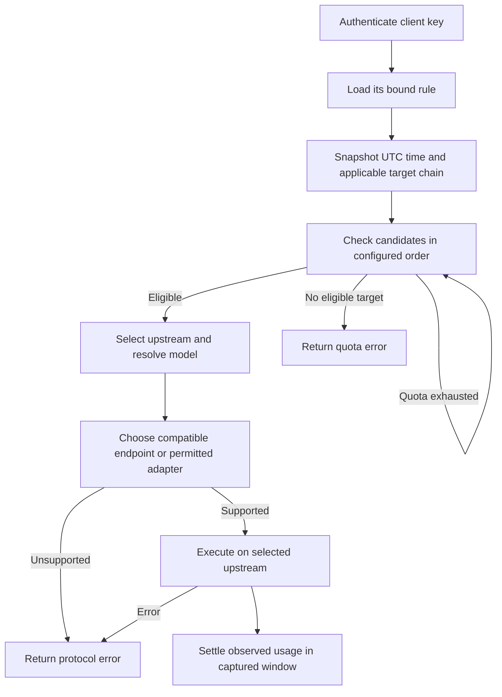

# 28 — Key-Bound Routing, Schedules and Upstream Quotas

Status: **Design — independent review in progress; not implemented**.

Design revision: **R1**. Decisions confirmed with the owner on **2026-09-22**.

Scope: Dashboard navigation and configuration, Proxy routing, model catalogs,
local SQLite persistence, migration and isolated verification.

This document replaces the model-pattern routing design in
[11](11-custom-upstream-routing.md) when implemented. It preserves the layering
contract in [20](20-architecture-refactor.md) and the operational constraints in
[26](26-agent-operations.md). It does not claim that proposed routes, adapters,
migrations or tests already exist.

## 1. Confirmed product contract

| Area | Required behavior |
| --- | --- |
| Navigation | Add a **Routing** sidebar group containing **Upstreams** and **Routing Rules**. Keep Connect as the key-management and client-configuration page. |
| Keys | Every client key belongs to exactly one rule. A rule can serve many keys. There is no unbound-key routing path. |
| Existing keys | Bind every existing database key to the built-in GitHub Copilot rule without rotating secrets or changing key IDs. That rule enables protocol conversion and initially selects `gpt-5.6-sol` for `auto`. |
| Custom upstreams | Configure one format per upstream: Anthropic Messages, OpenAI Chat Completions or OpenAI Responses. Remove model patterns and model-name conflict checks. |
| Copilot | Show one protected, non-deletable built-in upstream using the existing GitHub OAuth/Copilot JWT integration. It has no implicit fallback privilege. |
| Rules | Support an all-day policy, a repeating daily timetable, or a weekday-specific timetable. Time boundaries have half-hour resolution. Support overnight periods and copying one day's settings to other days. |
| Time | Persist and evaluate schedules in UTC. Convert browser-local editing/display values in the frontend, including day-of-week rollover. |
| Candidates | Each period has an ordered list of quota candidates followed by one terminal fallback target. Every target names an upstream and an explicit model ID, selected from its catalog or typed manually. |
| `auto` | Resolve the rule and period from the authenticated key, select an upstream by candidate order and quota, then use that candidate's configured model. |
| Explicit models | Select the same upstream by rule, time and quota, but use the incoming model instead of the candidate's configured model. Catalog membership is not an admission requirement. |
| Conversion | New rules default to conversion disabled. A rule can explicitly enable it; the UI recommends native protocols. The migrated Copilot rule enables it to preserve existing Copilot client paths. |
| Quota ownership | An upstream has one optional shared quota across all models, rules and client keys. Configure its period, next reset timestamp, 1× token allowance and time-dependent consumption multipliers. |
| Quota selection | Skip exhausted candidates. After a reset restores allowance, the next request uses the earliest eligible candidate again. No sticky provider selection. |
| Request failure | Once an eligible upstream is selected, an error ends the request. Do not try another candidate or Copilot. This also applies to protocol incompatibility and model-not-found errors. |
| Approximation | Use soft limits. Lock the target, model, multiplier and quota window at request start; allow in-flight requests to overrun the limit. No live stream switching or manual consumed-token calibration. |
| Model discovery | Persist fetched catalogs and manual model IDs. Custom catalogs refresh only on an explicit user action. Copilot refreshes periodically in the background. |
| Model listing | `/v1/models` reads existing caches only and returns `auto` plus all known model IDs, deduplicated by exact ID. No upstream UUID prefix and no filtering by the caller's rule or current period. |
| Upstream testing | A user may explicitly send one small `ping` request asking for `pong` to a selected upstream/model. Discovery refresh and generation testing are separate actions. |

The model list is a global picker. It does not guarantee that the upstream
selected by a particular key and period implements every listed model.

## 2. Verified starting point

| Current implementation | Consequence for the refactor |
| --- | --- |
| [`db/keys.ts`](../packages/proxy/src/db/keys.ts) has no rule reference; [`middleware.ts`](../packages/proxy/src/middleware.ts) publishes only key identity. | Add a mandatory rule binding and carry its resolved identity into request context after authentication. Preserve the API-key/management-key separation. |
| [`core/router.ts`](../packages/proxy/src/core/router.ts) and [`lib/upstream-router.ts`](../packages/proxy/src/lib/upstream-router.ts) both match model patterns; handlers resolve providers again. | Replace provider selection with one rule decision in composition. Do not retain parallel old/new routers. |
| [`db/providers.ts`](../packages/proxy/src/db/providers.ts) stores patterns and only `openai`/`anthropic` formats. Copilot is outside this collection. | Store explicit upstream type/format and catalogs; make Copilot addressable by stable upstream ID. |
| Provider create/update probes models; `/v1/models` and `/api/connection-info` fetch custom catalogs; authenticated requests can refresh Copilot's one-hour cache. | Remove discovery side effects from ordinary reads, auth and custom-upstream saves. Use explicit custom refresh and an independent Copilot timer. |
| Chat input to custom Anthropic is rejected; Responses input to any custom upstream is rejected. | The conversion switch and custom Responses support require real adapter work, not just a UI flag. |
| [25](25-messages-responses-shim.md) is a design, not an implemented Messages-to-Responses adapter. | `auto = gpt-5.6-sol` must be tested with a Responses-only Copilot fixture, including Messages clients; enabling conversion alone does not implement that path. |
| [`db/request-sink.ts`](../packages/proxy/src/db/request-sink.ts) stores request-end analytics, with upstream names rather than stable provider IDs. | Add stable routing/usage attribution and authoritative quota settlement separate from best-effort analytics writes. |
| Existing `input_tokens` means uncached input; cache read/write counters are separate. | Keep Monitor's existing meaning. Define a separate normalized quota total instead of reusing the generated analytics `total_tokens` column. |

Existing tests can supply mocks and fixtures. No live GitHub/provider request is
needed to write or review this design.

## 3. Domain and persistence

Reuse the local Bun/SQLite database. No remote service, scheduler deployment,
new provider SDK, distributed quota service or generic rule language is needed.

| Entity | Essential state |
| --- | --- |
| Upstream | Stable ID, display name, kind (`copilot` or `custom`), enabled state; custom endpoint, credential, single protocol format and existing proxy/auth options. Optional quota policy. |
| Upstream catalog | Last successful fetched snapshot with model metadata, manually entered IDs, last successful refresh time and sanitized last refresh error. Owned by upstream ID and durable across restart. |
| Routing rule | Stable ID, name, `allow_conversion`, default target chain, mode (`all_day`, `daily`, `weekly`) and UTC intervals with target chains. |
| Target | Upstream ID plus configured model ID; its order determines priority. Quota configuration belongs to the upstream, never to a duplicated rule-local allowance. |
| Client key | Existing key identity/hash/prefix plus non-null `rule_id`. Key creation and update validate that the rule exists. |
| Quota window | Stable window ID, upstream ID, UTC start/end, charged weighted tokens. A request retains its captured window ID until settlement. |
| Usage settlement | An idempotent request/upstream-call identity, window ID, observed token categories, multiplier and weighted debit. Persist the debit and aggregate update atomically. |

Persist rule/period target chains and multiplier schedules as validated JSON
unless normalized tables demonstrably simplify integrity checks. Validate all
upstream references during the same SQLite transaction that saves a rule or
deletes an upstream. Enforce key-to-rule references in SQLite with foreign keys.

The protected Copilot upstream is a built-in driver, not a custom bearer-key
entry. It chooses an actual endpoint using its cached model capabilities. The
single-format selector applies to custom upstreams. Preserve GitHub OAuth versus
Copilot JWT distinctions and the existing SOCKS5 policy.

The built-in Copilot rule is also protected from deletion because it is the
explicit binding for the environment client key. Its default chain contains
only `(Copilot, gpt-5.6-sol)`, with no quota initially configured. Its model can
subsequently be edited. New database keys default to this rule in the form, but
the API requires an explicit valid `rule_id`; null is never stored.

`RAVEN_API_KEY` keeps its existing secret and `env:default` identity and explicitly
resolves to the built-in Copilot rule. `RAVEN_INTERNAL_KEY` remains a management
credential and is not accepted on inference endpoints. This work does not change
the existing management authentication policy.

Deleting a referenced rule or upstream returns a conflict with references for
the user to resolve. Never silently rebind keys or rewrite target chains. The
built-in Copilot upstream cannot be disabled. Disabling a custom upstream makes
new selection of that target fail explicitly; it does not introduce a new
error-driven candidate-switching policy. Already admitted requests retain their
configuration snapshot, and deleted IDs are never reused.

## 4. Timetables and UTC

An all-day rule uses its default chain. A scheduled rule uses the matching
period's chain; outside configured periods it uses its explicitly configured
default chain. A period's terminal fallback and the rule's default chain are
distinct, visible configuration values. Neither implies Copilot.

Use half-open intervals `[start, end)`. At an exact boundary, the new period
applies. Reject overlaps after normalization, including overlaps caused by
overnight intervals. Reject zero-length ranges; all-day mode represents 24 hours.

Daily schedules repeat every UTC day. Weekly schedules use an explicitly defined
Monday-based UTC week. Expand an overnight range into non-overlapping pieces
across the day/week boundary. The UI may join those pieces for editing. Copying
a local weekday copies its displayed wall-clock intervals and target chains,
then converts and validates the entire resulting UTC week atomically.

For example, Monday 00:00–02:00 at UTC+08:00 is Sunday 16:00–18:00 UTC. It must
not be stored as Monday UTC. The UI shows the timezone and offset during editing
and preview, and saves all affected UTC days together.

The stored recurrence is fixed UTC. A timezone or daylight-saving change alters
the displayed local time; it does not silently reschedule the server. The editor
uses the browser's current offset when saving and shows the resulting UTC times.
Do not build a civil-time/DST recurrence engine. Half-hour editing steps remain
half-hour steps even in a zone with a 45-minute UTC offset: UTC minute offsets
need not themselves be multiples of 30.

Quota multiplier schedules use the same interval evaluator, with a default 1×
multiplier outside configured intervals. Support daily and weekly modes without
creating a second scheduling engine.

Capture one UTC timestamp after authentication at the inference boundary. All
selection, multiplier and window decisions for the request use that timestamp.
Changing schedules, quotas or key bindings affects subsequent requests. It does
not redirect a running generation, including a long SSE stream.

## 5. Routing algorithm



1. Reject invalid/revoked keys before any upstream I/O or rule execution.
2. Load the authenticated key's rule. A missing/corrupt binding is a configuration
   error, never permission to use the default Copilot driver.
3. Select the period or default chain using the captured UTC time.
4. Consider quota candidates in order. A candidate without an enabled quota is
   immediately eligible; otherwise compare its shared charged usage with its
   configured allowance. Only quota exhaustion skips a candidate.
5. The terminal fallback can use any upstream/model. It still obeys that
   upstream's shared quota if configured. If it is also exhausted, return a
   protocol-shaped 429 `quota_exhausted`. There is no implicit next target.
6. For the exact case-sensitive reserved ID `auto`, use the selected target's
   model. Otherwise preserve the incoming model choice and do not use the
   target's configured model as a substitute. Do not search other catalogs for
   a provider that advertises it. Existing Copilot-specific alias handling stays
   inside that driver to preserve current clients; custom model IDs stay raw.
7. Check protocol compatibility and the rule's conversion flag. Failure is a
   local protocol-shaped 400, without trying another target.
8. Dispatch once to the selected upstream. A timeout, 401, 404, 429, 5xx, inline
   SSE error or malformed reply does not select a new upstream or model.
9. Settle usage once, including observed usage on an errored/cancelled request,
   then finish existing request logging. Never turn a failed stream into success.

The rule engine adds no retries. Existing Copilot credential renewal and the
existing same-provider parameter-repair behavior are separate mechanisms; do
not extend either into a provider fallback loop. Server-tool interception keeps
its existing decorator and selected target for the entire incoming request.

## 6. Protocol policy and implementation boundary

Custom formats are `anthropic_messages`, `chat_completions` and `responses`.
The existing custom OpenAI setting maps to `chat_completions`; Anthropic maps
to `anthropic_messages`. Select a protocol before sending, never by probing one
generation endpoint and retrying another after an error.

With conversion disabled, only a matching protocol is accepted. Copilot uses
cached `supported_endpoints` to determine native eligibility. A missing/ambiguous
capability declaration must not silently authorize a cross-protocol request.

With conversion enabled, the target behavior for stateless text/chat and ordinary
function-tool turns is:

| Client → upstream | Messages | Chat Completions | Responses |
| --- | --- | --- | --- |
| Messages | Native | Convert | Convert |
| Chat Completions | Convert | Native | Convert |
| Responses | Convert | Convert | Native |

This matrix is an implementation target, not a claim about current coverage.
Reuse existing pure translators and the Chat-to-Responses work where suitable;
implement and test missing directions before claiming this design complete.
JSON and SSE, tool call/result correlation, usage and error shapes are required.
Avoid a universal intermediate representation unless an existing translator
already supplies the needed shape; explicit small adapters are sufficient.

Lossy translation is not silently accepted. Cross-protocol requests using opaque
provider state such as `previous_response_id`, encrypted reasoning, unsupported
multimodal blocks or provider-specific tools return an explicit unsupported
feature error when they cannot be represented. Native requests keep existing
capabilities. This project does not add server-side conversation replay or
promise that stateful IDs survive a scheduled upstream switch.

The built-in GHC rule initially enables conversion. It preserves existing
native/translated Copilot paths and must support its configured `auto` model in
the three inference entry points, using an isolated Responses-only fixture for
`gpt-5.6-sol`. This requires resolving the known Messages-to-Responses gap; do
not claim the default works solely because `allow_conversion` is true.

## 7. Shared soft quotas

### 7.1 Policy and periodic windows

Configure an optional positive token allowance, a positive duration (default
five hours), and a UTC next-reset timestamp that calibrates the repeating cycle.
This is a fixed repeating window, not a sliding last-five-hours query. If Raven
was stopped through several cycles, advance to the current window directly;
do not issue requests, run catch-up jobs or manufacture intervening usage.

Persist windows and debits so a restart does not restore quota. Advance windows
lazily when reading quota state or admitting a request. No quota timer is needed.
Long requests settle into their captured window even after a reset. Concurrent
requests admitted before exhaustion may finish over the allowance; no token
reservation, stream truncation or distributed lock is required.

Limit and multiplier edits affect later admission/charging without erasing
already charged usage. Editing the next reset changes the end of the active
window without clearing its balance; a new duration governs subsequent windows.
If the new reset is already in the past, advance to its current cycle on save.
Show the next reset and effective remaining allowance in the editor preview.
Do not add a control for adjusting consumed usage or querying a provider's
private billing system.

### 7.2 Normalized debit

The 1× total counts each reported token once:

```text
T = uncached_input + cache_read_input + cache_write_input + output
weighted_debit = T × multiplier_at_request_start
remaining = max(0, allowance - sum(weighted_debits_in_window))
```

OpenAI prompt counts usually already include cache reads: subtract that subset
before adding the explicit cache category. Anthropic reports cache categories
separately. Reasoning tokens already included in output are not added twice.
Use finite positive multipliers and retain fractional weighted totals consistently.
For example, 100,000 tokens at 2× consume 200,000 of the configured 1× allowance;
at 0.5× they consume 50,000. Cache categories use the same time multiplier.

Keep the analytics `input_tokens` and `total_tokens` meanings unchanged. Quota
debits are additional accounting, not a relabeling of existing Monitor metrics.
Changing a multiplier does not recompute historical debits.

Capture usage in the actual upstream execution path for JSON, SSE and server-tool
subcalls. Request streaming usage from providers that support it. Debit each
upstream call once; do not repeatedly sum cumulative stream usage frames or add
both a tool-loop aggregate and its component calls. All subcalls of a single
incoming request retain its selected target/window/multiplier. Observed usage
counts even when the request later errors or the client disconnects.

When usage is absent, record it as unknown rather than pretending it is zero or
precisely estimated. Charge the observed categories, if any, and expose incomplete
accounting in quota status. This is a known soft-limit accuracy boundary; no
provider-specific billing estimator or strict budget guarantee is part of scope.

Use an atomic, idempotent settlement in SQLite. An aggregate update and its debit
record either both commit or neither does. The existing best-effort log sink must
not be the only route to quota persistence. On a settlement storage failure,
surface an operational error and mark that upstream's quota accounting unhealthy;
do not silently keep admitting quota-controlled requests as if its balance were
accurate. A process crash can lose the final unreported usage of in-flight calls;
the accepted soft-limit model does not promise reconstruction of that usage.

## 8. Catalogs, refresh and manual testing

Keep the fetched snapshot separate from manual IDs. A successful refresh replaces
the fetched snapshot atomically, preserving manual entries; a failed refresh
preserves the last good snapshot and records a sanitized error. Deduplicate the
union by exact model ID. A hardcoded target remains valid configuration even
when absent from both lists. Model metadata includes supported endpoints and
limits where available, especially for the Copilot driver.

Custom saves, page loads, auth, `/api/connection-info`, `/api/copilot/models` and
`/v1/models` must never initiate custom discovery. A custom model refresh is an
explicit management POST. The same POST may manually refresh Copilot. Discovery
uses the saved endpoint and authentication settings, not speculative generation
requests or an automatic auth-style retry loop.

Restore Copilot's last good catalog at startup. Use a single non-overlapping
background refresh with the existing one-hour cadence, including an initial
refresh scheduled independently of model-list reads. On failure retain the cache
and wait for the next normal interval; no tight retry loop. The Copilot JWT
sentinel remains independent and continues renewing credentials normally.

`GET /v1/models` and Connect's model view use one shared catalog projection:
`auto` once, then all known IDs from all current upstreams. Deduplicate without
rewriting IDs or adding UUID prefixes. Use stable ordering and deterministic
metadata precedence: Copilot metadata first for a duplicate, otherwise stable
upstream order. Mark the virtual `auto` entry as Raven-owned; do not fabricate a
single context limit for a model whose actual target changes by rule and time.
Catalog data is descriptive, not routing input for choosing a provider.

The management generation test names an upstream and raw model explicitly and
bypasses key-rule selection. It uses the selected upstream's native protocol,
one bounded non-streaming request asking for exactly `pong`, and no retry or
fallback. Respect and charge that upstream's quota. Report generation success,
latency and the actual bounded response separately from catalog refresh status;
an unexpected answer is not a network/auth failure. Never run this diagnostic
on page load, save, CI or routine automated verification.

## 9. Dashboard and API surfaces

Use the existing Next.js BFF and Basalt components. Keep view-model hooks or pure
form/state helpers separate from the Upstreams and Rules views; do not grow the
current monolithic content components further. Use design tokens, compact rows,
accessible labels and timezone annotations. Read installed Next.js guides before
changing framework API usage.

| Surface | Responsibilities |
| --- | --- |
| `/routing/upstreams` | Protected Copilot entry; custom CRUD and single format; manual/fetched models; explicit Refresh Models and Test controls; last refresh/error; shared quota policy, use, multiplier and next reset. |
| `/routing/rules` | Rule CRUD; default chain; daily/weekly editor and copy-day action; ordered targets with model select/free text; terminal fallback; conversion toggle and protocol compatibility preview. |
| `/connect` | Create/edit key bindings; show rule names; preserve revoke/delete and one-time raw-key display; update examples to explain `auto` and explicit models. |
| `/api/upstreams` and `/api/upstreams/:id` | Read/write config and cached status only. Save does not probe upstreams. |
| `POST /api/upstreams/:id/models/refresh` | Explicit discovery and atomic snapshot replacement. |
| `POST /api/upstreams/:id/test` | One explicit quota-accounted generation test. |
| `/api/routing-rules` and `/api/routing-rules/:id` | Validated rule CRUD and reference conflicts. |
| `/api/keys` and `PATCH /api/keys/:id` | Mandatory rule binding on create; edit a key's binding without rotating its secret. |
| `/v1/models`, `/api/connection-info`, `/api/copilot/models` | Cache projections; no read-triggered refresh, including no `?refresh=true` mutation. |

Remove the old `/settings/upstreams` page and the old live-health GET endpoint
when callers are replaced. Do not retain compatibility redirects or the old
model-pattern payload schema. Keep Copilot account/token operations in their
existing section; catalog views consume the shared cache.

## 10. Composition and observation

Authentication remains in middleware. Add a pure rule/time/quota selector under
`core/`; inject rule, upstream and usage snapshots through composition. Resolve
the provider once. Protocol adapters remain pure, strategies receive dependencies,
and only composition bridges routes to strategies/upstream clients.

Extend request context with rule ID, period identity, requested model, resolved
model, stable upstream ID, admission timestamp, quota window and multiplier.
The selected provider and rewritten `auto` payload reach strategies together;
handlers must not rerun pattern matching or independently infer another provider.

Keep actual model IDs and existing JSON/SSE shapes. Log both the incoming model
(`auto` where applicable) and resolved raw model. Add rule/upstream/window IDs,
weighted usage and skip reasons to structured routing telemetry. The Requests
drawer should make the selected rule, target and quota decision inspectable.
Preserve request correlation, stream errors and the shared log-stream contract.

Inference scope covers Messages, Chat Completions and Responses, including
existing aliases. `/v1/messages/count_tokens` must resolve `auto` using the same
decision without debiting quota or calling a provider, then use the local
estimator. Model listing remains global. Embeddings retain their existing Copilot
path and are not assigned chat models by this rule engine; document this explicit
scope boundary in client-facing setup material.

## 11. One-time migration and usable delivery steps

The owner explicitly authorized migrating existing keys. This is a one-time
data/schema change, not a retained compatibility router.

1. In one versioned SQLite transaction, create the stable built-in Copilot
   upstream/rule, map existing custom formats, add and backfill key rule bindings,
   and enforce non-null references. Preserve key IDs, hashes, revocation state,
   request history, upstream IDs/credentials, proxy options and auth settings.
2. Copy only exact existing model patterns into manual catalog IDs. Discard
   wildcards and then remove the pattern column/compiler/conflict code. No
   synthesized legacy routing rules: all existing keys bind to GHC as requested.
   Existing callers that depended on custom pattern routing must bind a new rule.
3. Introduce the shared persistent catalog and independent Copilot refresh.
   An empty custom catalog stays empty until manual entry/refresh. Do not probe
   credentials during migration. Preserve the platform-directory migration
   semantics documented in AGENTS.md; those are unrelated to removing patterns.
4. Ship a working all-day key-bound route and the Upstreams/Rules/Connect controls,
   then layer daily/weekly schedules and shared quota selection/settlement on it.
   Internal stages must preserve a working default Copilot route; the release is
   not complete until the entire contract and conversion target are implemented.
5. Complete missing native/custom Responses and conversion adapters, all affected
   token-count/logging paths, and the isolated acceptance suite. Remove replaced
   routes and duplicate selection code as their callers move.

Migration is transactional and idempotent across restart, checked on temporary
legacy databases. Do not reset the user's daily database for development or tests.
Protect durable files using existing application-directory permissions. Do not
add a new secret store, certificate operation or Keychain access.

## 12. Acceptance and verification

| Case | Required result |
| --- | --- |
| Existing-key migration | Raw keys still authenticate with unchanged identity/revocation; all bind GHC with conversion enabled and `auto = gpt-5.6-sol`; repeat startup does not overwrite edited rules or bindings. |
| Authentication | Invalid/revoked/internal-management credentials never dispatch inference. Environment client credentials use their explicit GHC rule binding. |
| Key relationship | Two keys share one rule; rebinding one affects only its later requests; deleting an in-use rule/upstream is rejected. |
| Explicit versus auto | At the same time and quota state, both choose the same upstream; only `auto` substitutes the configured model. Unknown hardcoded IDs are sent without a catalog lookup. |
| Time boundaries | Daily/weekly, half-hour boundaries, overnight spans, Sunday/Monday rollover, gaps, copied weekdays, UTC+08 and UTC+05:45 round trips; overlaps are rejected. |
| Concurrent edits | Running requests keep their captured route, model, multiplier and window; later requests see the saved configuration. |
| Shared quota | Multiple keys, rules and models share one upstream debit total; candidate order resumes after reset; restart retains usage; skipped cycles advance directly. |
| Weighted quota | Cache-inclusive normalization without double counting; 0.5×/1×/2×; incomplete usage; limit edits preserve charges; in-flight overrun and late settlement stay in the original window. |
| Settlement | Duplicate completion does not double debit; transactional storage failure cannot silently admit unlimited quota traffic; subcalls count once without aggregate duplication. |
| Terminal fallback | Any configured upstream/model works; its own quota still applies; all exhausted returns 429; no implicit Copilot path. |
| No failure switching | 400/401/404/429/5xx, timeout, protocol mismatch and SSE errors never dispatch the next candidate. |
| Protocols | Native 3×3 diagonal with conversion off; permitted cross-protocol JSON/SSE and two-turn tool exchanges with conversion on; unsupported stateful/lossy features reject explicitly. |
| Default model | Responses-only `gpt-5.6-sol` fixture works through the migrated rule for Messages, Chat Completions and Responses without endpoint-probing retries. |
| Cache-only reads | Model/Connect/Copilot page/API reads make zero discovery calls, including empty/stale caches; exactly one `auto`, deterministic exact-ID dedup, no UUID prefixes. |
| Refresh | Only explicit custom refresh replaces fetched data; manual IDs and last good data survive failures/restart; only Copilot has a non-overlapping background refresh timer. |
| Manual test | One click makes at most one native generation call, charges observed usage, and cannot trigger a refresh/retry/fallback. Automated cases use fixtures only. |
| UI | Basalt controls, compact accessible layout, current timezone labels, week/day copying, rule binding without secret exposure, referenced-delete conflicts and error feedback. |

Use real isolated SQLite state and a fake clock where time matters. Unit and
in-process HTTP tests mock all upstream HTTP. A temporary local fixture upstream
can verify end-to-end routing without real accounts; it does not automatically
upgrade the repository's planned L2/L3/D1 status. Do not run legacy live E2E/UI
runners as routine proof.

When implementing, run the root commands required by [AGENTS.md](../AGENTS.md):
`bun run typecheck`, `bun run lint`, `bun run test:all`, `bun run test:root`,
`bun run test:l2`, `bun run gate:coverage`, `bun run gate:arch` and
`bun run gate:security`. Preserve stricter baseline floors and normal hooks.
Run `bun run build` for the changed Dashboard runtime/bundler surface. Report
actual evidence and remaining isolation limits; do not mark unchecked acceptance
cases or unimplemented protocol directions complete.

## 13. Review record

This section records review of the design, not implementation acceptance.

| Reviewer | Revision | Result |
| --- | --- | --- |
| Author | R1 | Draft prepared against confirmed requirements and current source. |
| Independent Codex | R1 | Pending. |
| Independent Grok | R1 | Pending. |

The document is ready for implementation planning only after actionable findings
are resolved and both independent reviewers explicitly sign off the same revision.
